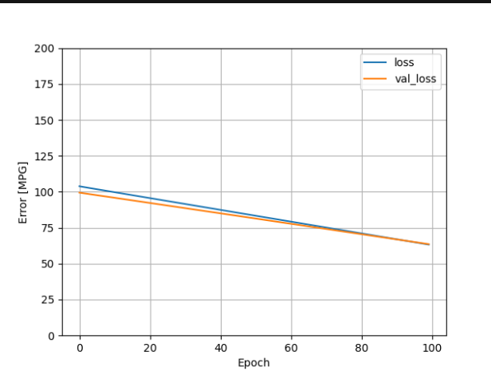
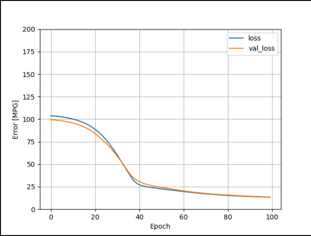
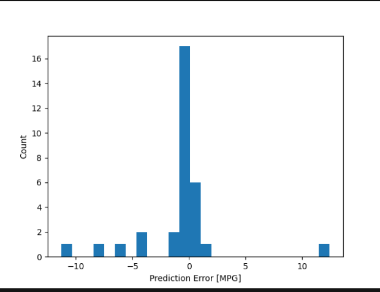

1. Which of the two models produced the better loss metric?

    The DNN model produced the better loss metric since its lowest loss was much lower than the regressor's lowest loss.
   

2. Plot that supports above:

Regressor's error vs epoch: 

DNN's error vs epoch: 

3. Continuous and categorical features added:
- make
- body-style
- fuel-system

4. Plot demonstrating value of model:

   
5. Best model produced:
    
    The best model produced was the one above, and the reason why it was the best was because
   it significantly lowered the mean absolute error for the linear model. Before adding the 
   fuel-system variable, the linear model's error was around 52. After adding that variable, it decreased to 2.24.
   The DNN error stayed low at 1.85.