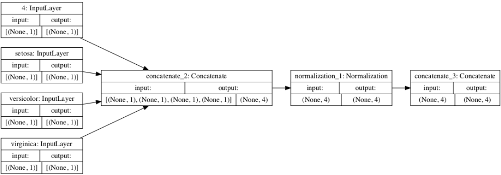
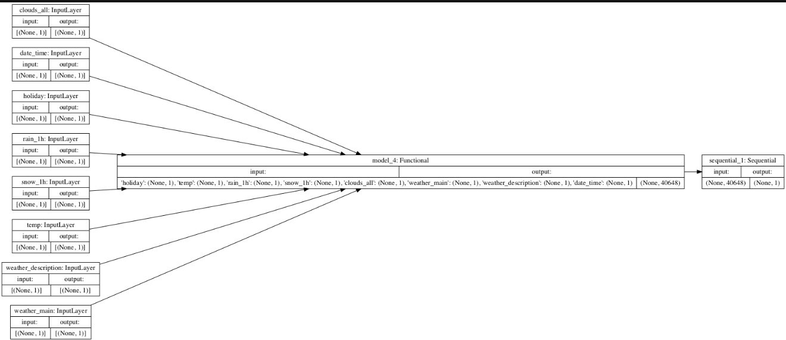
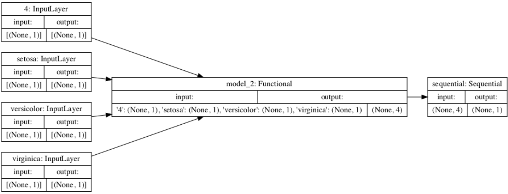

1. Plots describing input preprocessing step:

Metro:
   
Iris:
   

2. Describe the plot of each model for the two dataset preprocessing steps. 
   
    a. What does each box in the illustration represent? 
   
    b. Are there different paths towards the final concatenation step? 
   
    c. What is occurring at each step and why is it necessary to execute before fitting your model. 

3. Train each model and produce the output (not necessary to validate or test).
   
Metro:

Iris:

4. Describe the model output from both the metro traffic interstate dataset and the iris flowers dataset.
   
    a. What is the target for each dataset?
   
    b. How would you assess the accuracy of each model? 
   
    c. Are you using a different metric for each one? 
   
    d. Why is this so? 
   
    e. What is each one measuring?
   