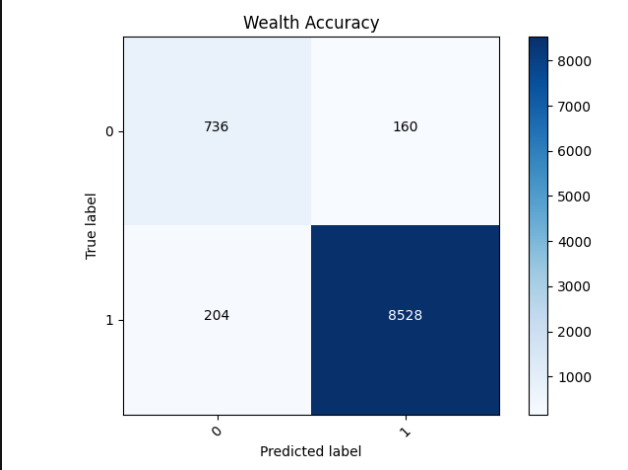

1. Predicting wealth vs all other classes as binary target

    - Best model:
      My best model was my fifth model. In my second model, I adjusted bucket sizes by using np.percentile to calculate the 25, 50, and 75th percentiles for the age and size columns.
      I changed my age buckets from 9, 18, and 75 to 7, 16, and 35. 
      Then in my fifth model, I removed the car column because it had very little variation in value. This slightly improved the accuracy of my model, but it mostly evened out the variation between accuracies for each epoch.
      Overall, every model I tried only resulted in small changes to the accuracy, and because of this my graphs all look very similar.
      
    - Worst model:
      My worst model was my first model.
      I used a numerical size column, a bucketized age column, and made the rest of the columns categorical. This was using Wednesday's approach. What was interesting about not only this model but the other models was that the worst accuracy was on the second wealth class, not the first.
      
    
2. Confusion matrix

First model:

Second model:

   - Analyze and discuss two sets of results
     
      As you can see, there is very little difference between the two models and their accuracy.
      The first model acheived an accuracy of 0.9621, and the second model had an accuracy of 0.9622. It looks like the removal of the car column increased the amount of true negatives and decreased the amount of false negatives.
     
3. Predicting wealth vs all other classes as categorical

    - Analyze and discuss results with confusion matrix as reference
        
        3 epochs:
        
        10 epochs:
        
      The model had an accuracy of 0.553 with 3 epochs and 0.573 with 10. It looks like weighted the first wealth bracket too heavily, and as a result past that bracket, the model quickly became less accurate. This was using my best model from the first section.
      
    - Modify feature columns in attempt to improve accuracy with all 5 categorical wealth classes as target. Analyze and discuss progress and results.
         
        Here is a list of the modifications I made, all run with 3 epochs except for the last modification, and their resulting accuracy, none of which were better than my first model:
            
        - Put the car column back in the model, 0.547
            
        - Removed the weights column, 0.552
            
        - Unbucketed size, 0.542
            
        - Crossed the age and education columns, 0.549
            
        - Crossed the weights and location columns, 0.552
            
        - Crossed the toilet and potable columns, 0.538
            
        - Dropped the electric and car columns, 0.547
            
        - Kept the electric column in but not as a feature column (10 epochs), 0.569

        
    
    