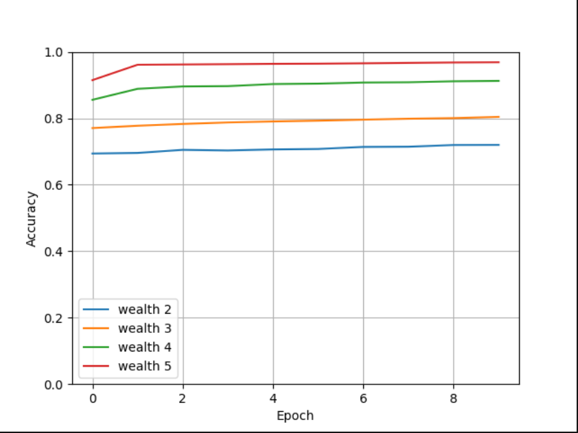

1. Predicting wealth vs all other classes as binary target

First model:

    - Best model:
    - Worst model:
    
2. Confusion matrix

    - Analyze and discuss two sets of results
    
3. Predicting wealth vs all other classes as categorical

    - Analyze and discuss results with confusion matrix as reference
    - Modify feature columns in attempt to improve accuracy with all 5 categorical wealth classes as target. Analyze and discuss progress and results.
    
    