1. CNN
   
    a. beans dataset
   
   1. results
      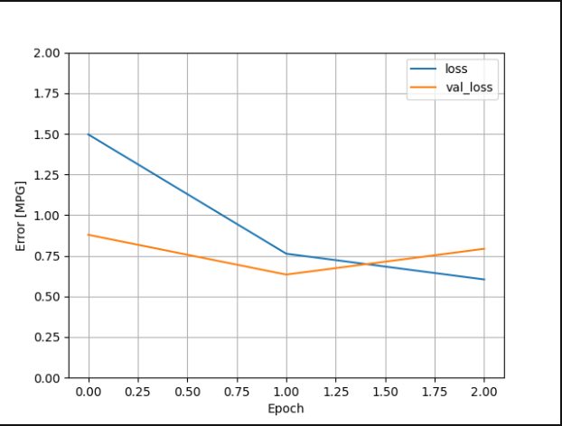
      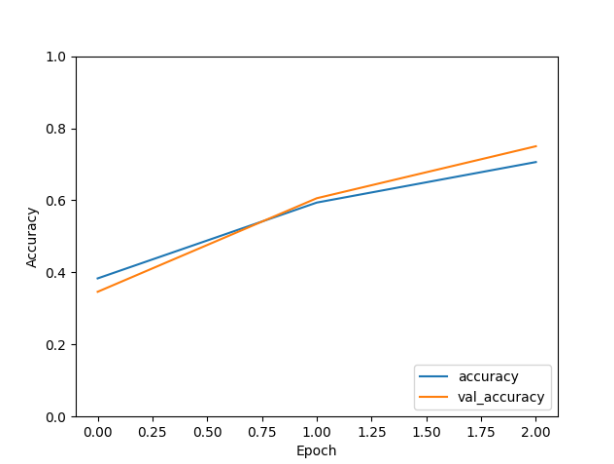
   2. accuracy
      
      The highest accuracy the beans dataset went to was nearly 80%, which is not bad.
   
   b. eurosat dataset
   
   1. results
      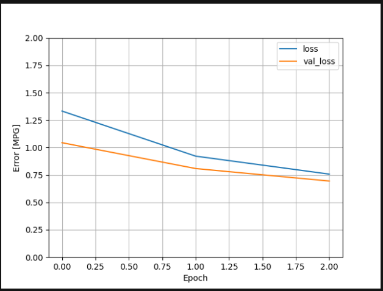
      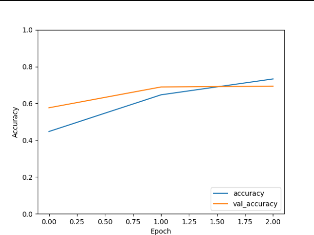
   2. accuracy
      
      The highest accuracy the eurosat dataset went to was also about 80%. Both datasets had
      roughly the same amount of error as well.
 
     
2. Image augmentation
   
    a. Did your model performance improve?
   
      No, in fact for both datasets my model's performance greatly decreased.
   
    b. How many epochs were you able to run and how much time did it take?
   
      I was able to run 10 epochs for the beans dataset, which only took about 2 minutes - the length of one epoch before augmentation.
      However, the eurosat dataset took 6 minutes for each epoch, so I ended up only doing 3.
   
    c. Results
      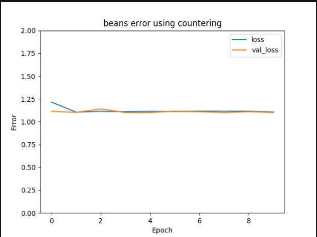
      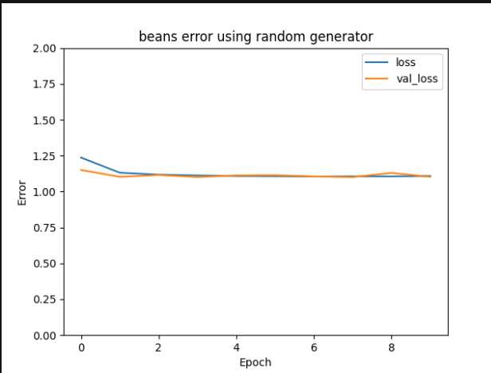
      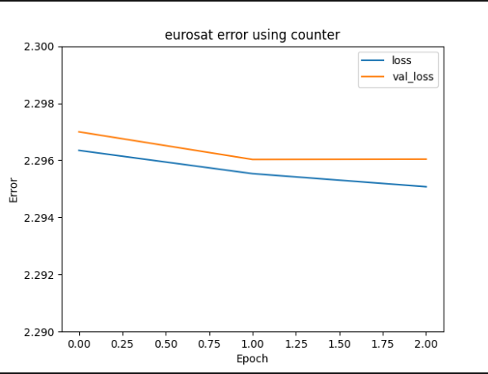
      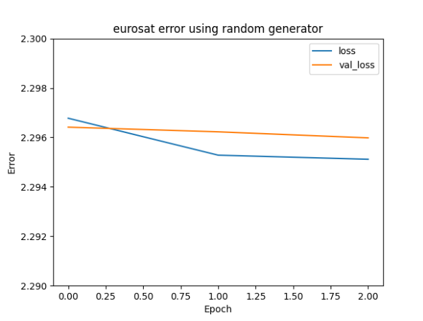
    d. Accuracy
      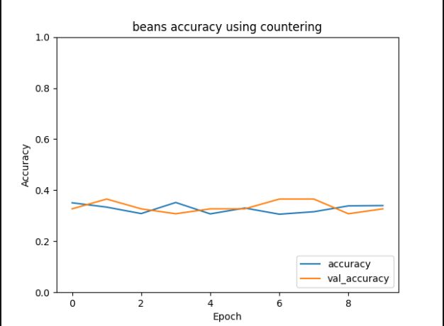
      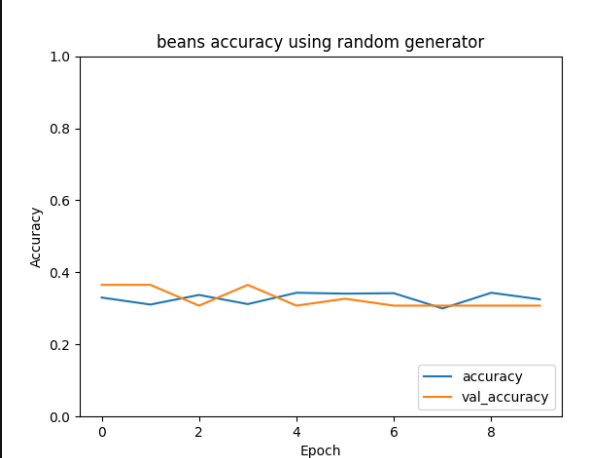
      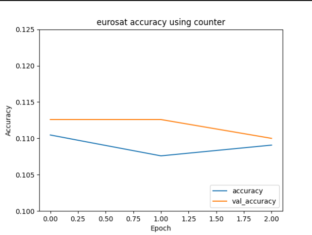
      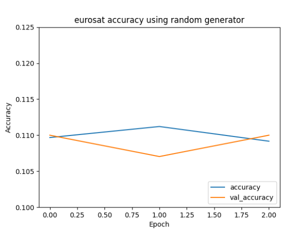