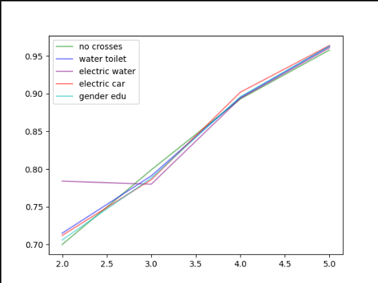
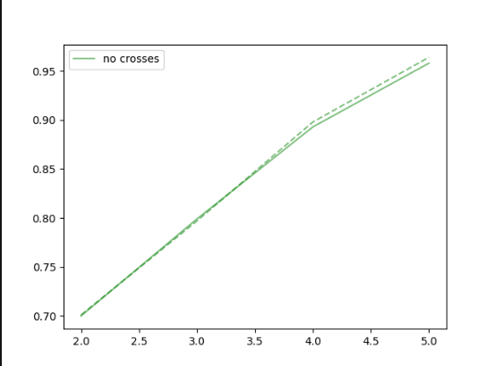
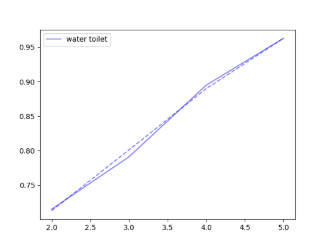
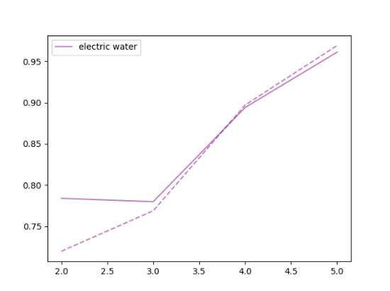
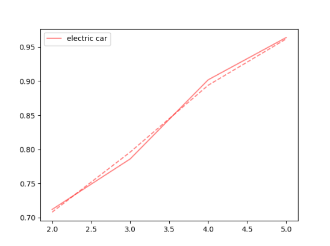
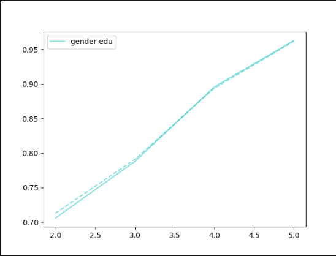

The first model I tried was with weights, age, unit, and size as numerical, gender and education as categorical (but numbers), and location, potable, toilet, electric, car, and cook as categorical. 
It was very accurate (0.958) for a wealth of 5, but became progressively less accurate (0.700 at the lowest) the lower the wealth was.

I tried to improve my model through various crosses between columns that I thought would be correlated: water and toilet, electric and car, electric and water, gender and education level, but as you can see below none had any major impact on the accuracy of the model:

The x axis is wealth and the y axis is accuracy.

When combined with testing data, this is the result:

Maggie tried improving the model by altering the batch sizes, epoch, columns, and optimizer, and also did not succeed in creating any major improvements.
