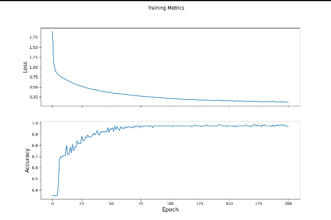

We used data from the iris dataset in our model. It measures sepal length, sepal width, petal length, and petal width for three species of flowers.

To create a tf.dataset, we first used tf.keras.util.get_file to import the dataset from its url. Then we identified what column labels are features and what column label is the target, as well as the target’s class names. Finally, we used tf.data.experimental.make_csv_dataset to create a tf.dataset. 
We passed in the training dataset as the data, a 32 batch size, the column names as the feature names and the label name as the target name, and set the number of epochs to 1. 
This function then shuffled/parsed through the data and reorganized it into a tf.dataset, which is characterized by dictionaries where feature names are the key and numbers are values. In other words, the columns are individual dictionaries, which makes them mutable and iterable. Also, the amount of values that are displayed in the arrays were controlled by the batch size of 32.

Before creating our model, we altered the shape of our dataset and as such the input shape of our model. Our input shape was formatted as (batch size, number of features), and actually was (5, 4). We achieved this by using tf.stack and tf.data.Dataset.map.
With this done, we could move onto the model itself.

First, we chose the tf.keras.Sequential constructor for our model so we could stack our layers linearly.
Next, we made our layers: two dense layers with 10 nodes and dense layer with 3 nodes. Our last layer, the output layer, has 3 nodes because that is the amount of classes in our dataset.
In our first dense layer we defined our input shape.
In our first two layers we also defined the activation function. This function controls the output shape of each layer. We used RELU activation.  

Next, we trained our model. Training is when a model learns correlations between feature and target through routinely predicting feature – target matches and being penalized for wrong answers. This is done through loss, which is a metric of how incorrect the model’s prediction was. We used the SparseCategoricalCrossentropy loss function for our model, which calculates the loss by compares the model’s prediction to the label. It does this for many examples and then returns the average loss. Since the Iris dataset has multiple classes, this was the function we had to use.

We optimized our model by using stochastic gradient descent. Stochastic gradient descent minimizes loss by altering parameters until it finds parameters that result in the lowest loss. First we created a function that uses tf.GradientTape to calculate gradient descents. Then we set up the optimizer and used optimizer.apply_gradients to apply gradients.

Next we applied SGD to the entire dataset. Below is a plot of our loss per epoch that illustrates the change in loss over each epoch due to the SGD we used. 

To evaluate our model, we fed our model a testing dataset of data it hadn’t seen before and asked it to predict what flower each was. So that it doesn’t learn this dataset, we only let it run for one epoch and then assess the model by its accuracy on the training dataset.

To predict what labels should match which feature values, we passed a training dataset into our model and iterated through each prediction, finding the highest probability and then corresponding that probability to the correct class name.

