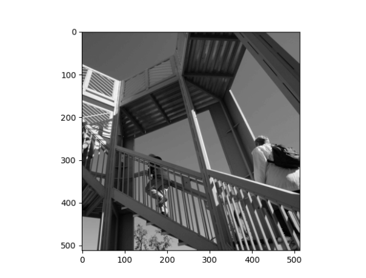
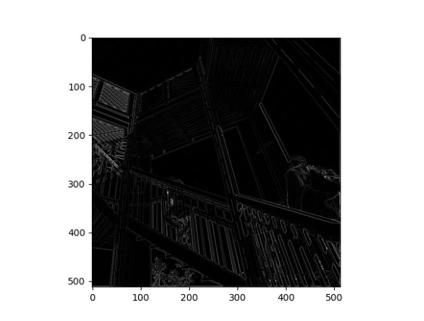
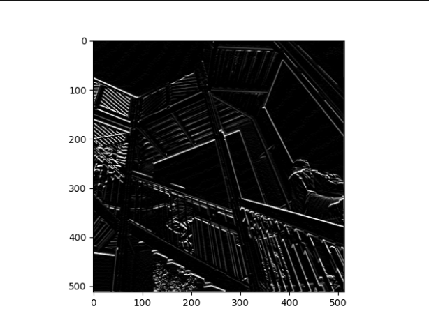
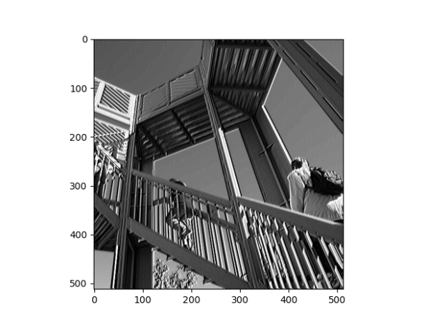
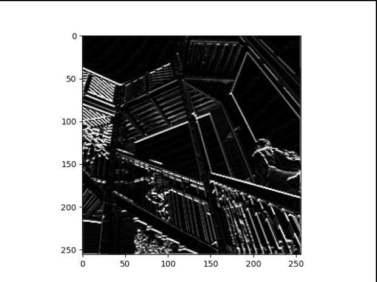

1. Describe the dataset

    - Type of variable (target): binary
    - How many features are being used: 28
    - How many observations are in the training dataset: 10,000
    - How many are used in the validation set: 1,000
    

2. Performance

    - How did each of the models perform?
      
      The tiny and small models performed the best, but the medium and large models did not perform well at all.
   
    - Which of the four performed the best?
   
      The tiny model performed the best.
    - Which ones performed the worst?
      
      The medium and large models performed the worst.

    - Why did some perform better?
      
      The ones that perfomed better were not overfit like the medium and large models were;
      while the dataset itself is large, there are only 28 features and the larger network sizes 
      that lead to overfitting were all over 28 units and the smaller ones were all under 28 units, so that could have something to do with it.
    

3. Overfit

    - What is an overfit model?
      
      An overfit model is a model with higher capacity than the dataset.
    - Why is it important to address it?
      
      Overfit models will not be able to generalize their predictions accurately.
    - What are four ways we have addressed it so far?
      1. Decreasing the size/complexity of the model in general (not by weights)
      2. L2 regularization 
      3. Dropout
      4. Combined L2 and dropout
    

4. Load and preprocess images

Original Image:

Filtered Images:

   - What are you functionally accomplishing as you apply the filter to your original array?
      
      Functionally I am extracting and showing common features from/in an image.

   - Why is the application of a convolving filter to an image useful for computer vision?
     
      It can help a computer identify common aspects to something like a piece of clothing.
     In other words, it can help a DNN model recognize certain aspects of a picture as unique to 
     an object, therefore letting it classify across a variety of picture formats.
      
4b. Pooling

   - In effect what have you accomplished by applying this filter?
     
      By applying this filter, I have lowered the size of the image from 500x500 pixels
     to 250x250 pixels.
   - Does there seem to be a logic (i.e. maximizing, averaging or minimizing values?) associated with the pooling filter provided in the example exercise (convolutions & pooling)?
     
     Yes, when pooling the filter keeps the largest value of the pixels surrounding it.
   - Did the resulting image increase in size or decrease?
     
     The image decreased in size.
   - Why would this method be useful?
     
        By reducing the size of the image while keeping features, the information represented in the image is much smaller
     and therefore much easier for a model to learn from. I would assume it decreases the chance of overfitting because of this.
   

5. Matrix:
    
    
    0 0 0 3 0 0 0 
    0 0 0 3 0 0 0
    1 1 1 3 1 1 1
    1 1 1 3 1 1 1
    1 1 1 3 1 1 1
    0 0 0 3 0 0 0
    0 0 0 3 0 0 0
   
