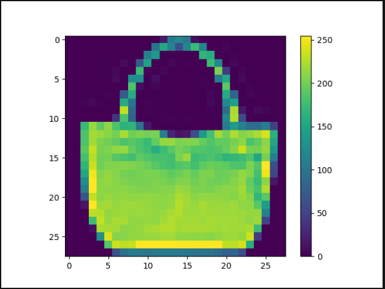
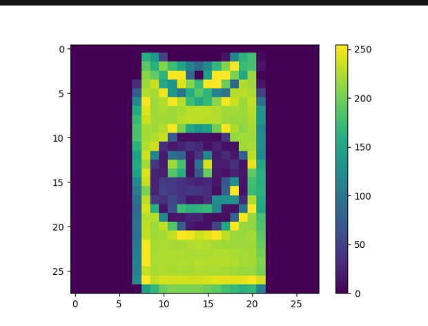
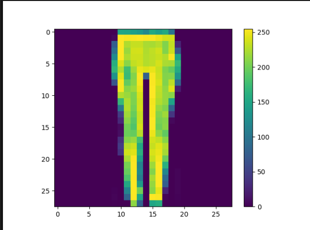
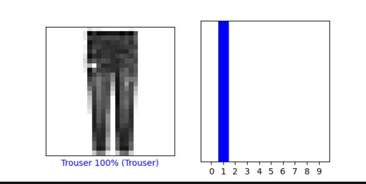
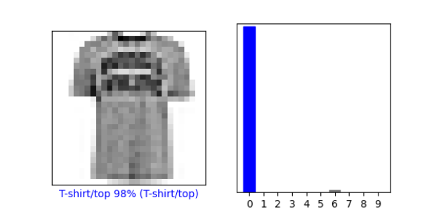

#Preprocessing
1. Pick 3 images:
    1. index 100
   
    2. index 101
   
    3. index 102
   
#Make Predictions
1. What does the array represent?
   
    The following is the predictions array for the 10th image.
        The numbers represent the model's confidence in the image's 
        correlation to each of the 10 labels. The higher the number, the
        higher the % of confidence.
        
        array([3.8757089e-06, 3.9885109e-08, 4.6757638e-02, 1.8446302e-08,
        9.4626385e-01, 9.9321662e-09, 6.9739721e-03, 2.2785258e-09,
        4.0543335e-07, 1.8399857e-07], dtype=float32)
2. How were softmax and argmax applied?
    
    Softmax converted output numbers from our model to probabilites we can interpret 
    through first calculating exponentials for each number, summing 
    the exponentials, and dividing each exponential by the sum.
   
    Argmax located the index in the predictions array with the highest number
    and therefore highest probability.
   

3. Does the np.argmax output match the label from test_labels?

    Yes: both were 4.
#Verify predictions
1. Plot 2 more images and include graph of predicted label in addition to image
   
    1. index 200
   
    2.index 201
   
#Use the trained model
1. New image, predict. Does predicted value match test label?
    
    No.
2. Why didn’t use softmax but argmax?
   
    When we made the probability model, we already converted
    logits to probabilities and thus don't need to again.

#Mnist
Produce a plot of 25 handwritten numbers from the data with their labels indicated below each image. Fit the model and report the accuracy of the training dataset. Likewise report the accuracy of the test dataset. As in the above example, from the Verify predictions section, plot two images and include the graph of their predicted label as well as the image itself.
So 1. Accuracy of training dataset

2. Accuracy of test dataset
    1.
3. Plot 2 images, graph of predicted label + image
    1.

#Comparison
1. Which of 2 models is most accurate?
    1.
2. Why?
    1. 

