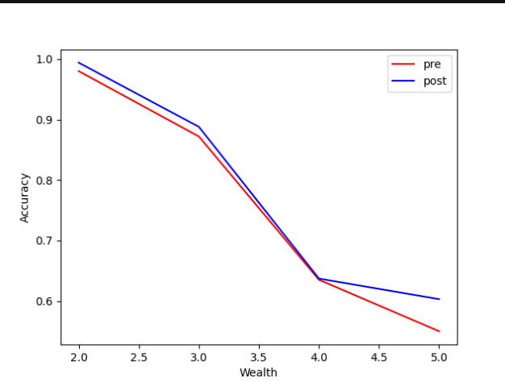

Unfortunately I was having issues with my model.fit call on Wednesday night, so I was unable to work with Michael and Dylan. Once I got it working on Friday afternoon, I tried to make a better model than they did but found their buckets and structure resulted in the highest accuracies, especially when looking at the highest wealth.

I made the plot below comparing my intial accuracy and the accuracy with Michael and Dylan's model:

My first model:

- Numeric columns - size, age

- Indicator columns - gender

- Categorical columns - edu

- No crosses

Michael and Dylan's:

- Numeric columns - size

- Bucketized columns - age

- Indicator columns - gender, edu

- Crosses - age and size

In both my first model and Michael and Dylan's, the accuracy of the model decreases as wealth increases.
I think at least part of this is related to the edu column. Babies and toddlers have an edu value of 0 or 1, but their wealth ranges a lot because it depends on their parents.
I don't think the model is distinguishing between adults who have a low education and therefore a low wealth and children who have no control over the level of their wealth and have lower education. 
In other words, low education level in adults is correlated to a lower wealth. However, children with a low education level but high wealth because of their parents' incomes could be contributing to the trend seen in the graph above.
