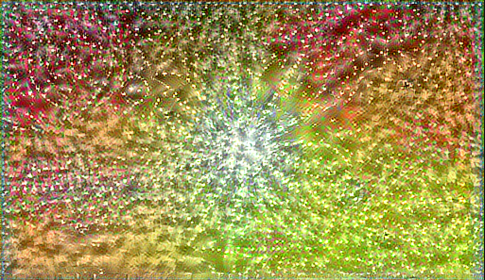
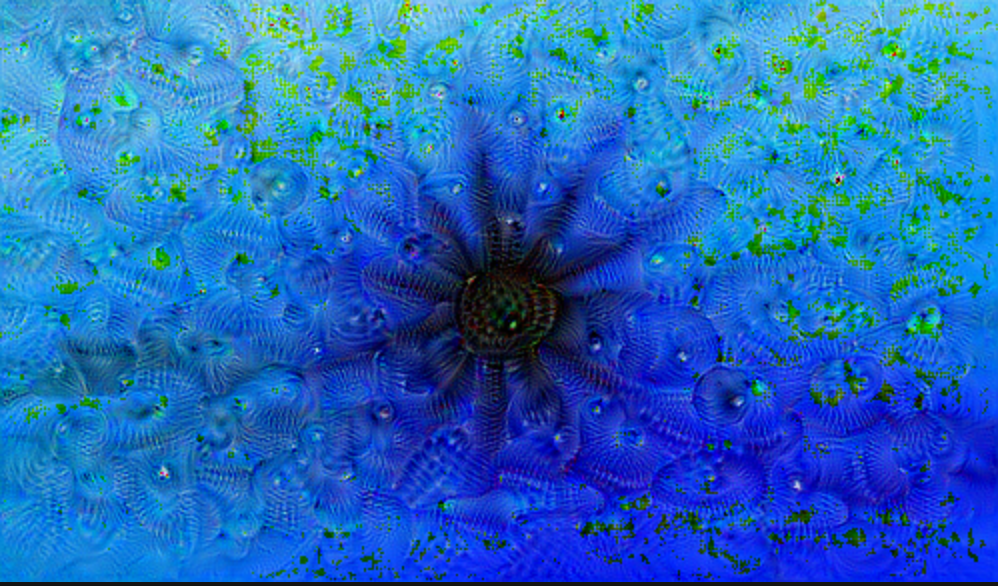
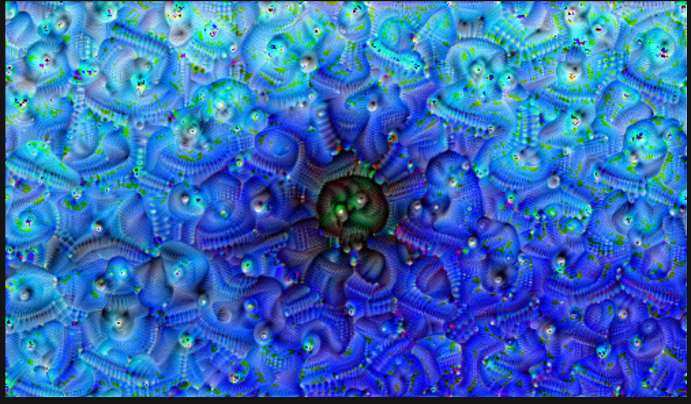
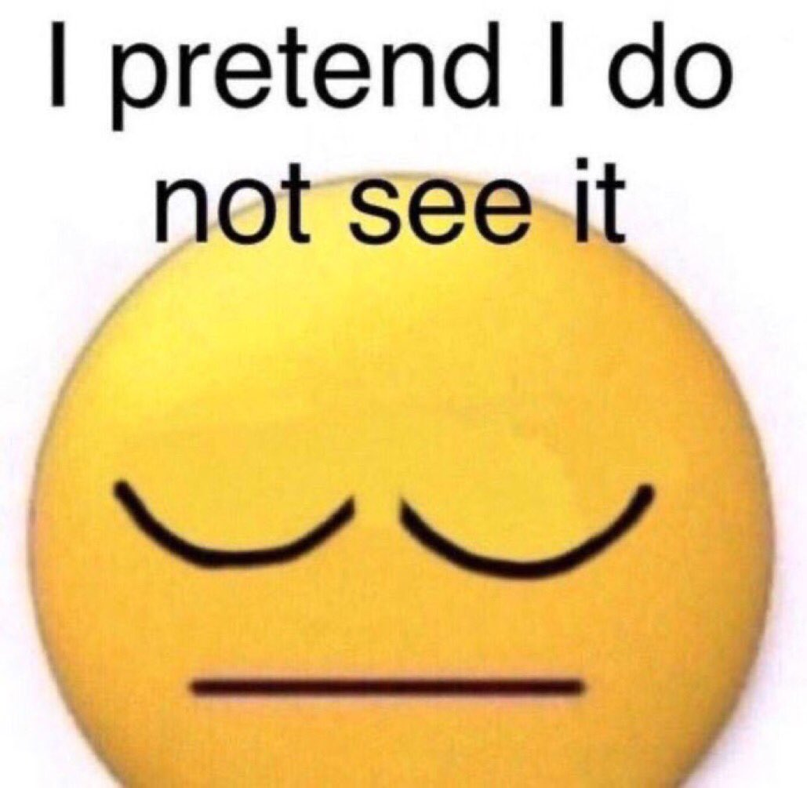
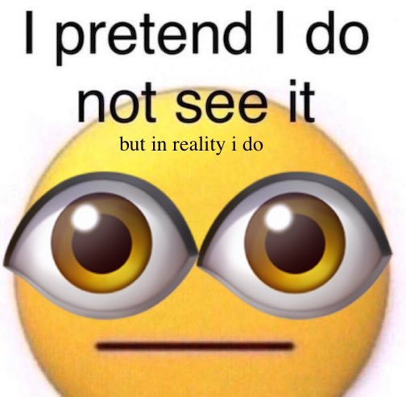
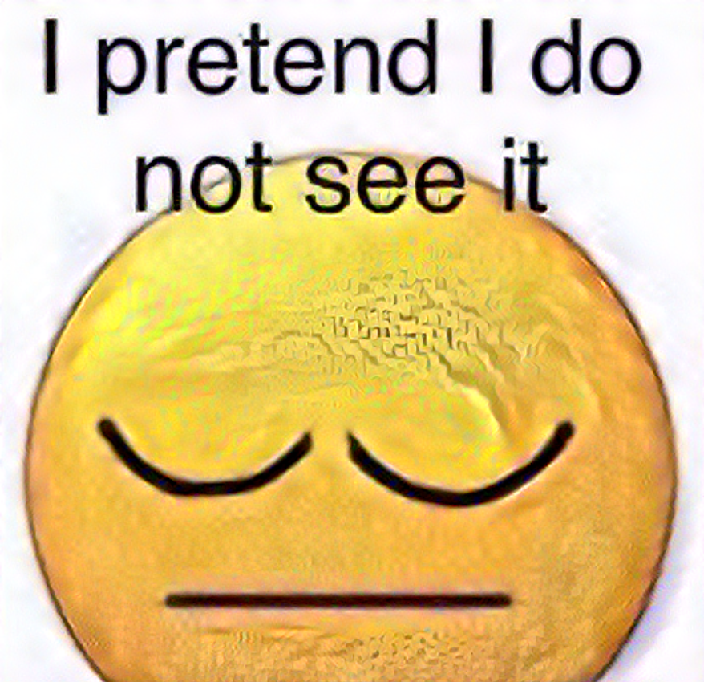

1. Describe your implementation of neural style transfer to your content and style images.
How did the application of the four steps from above produce your resulting work of art? 

    a. Define content and style representations
            
   Defining these lets us have some control over the output of the model based on which intermediate layers we choose to match the representations to, but mostly the control comes from 
    being able to define them in intermediate layers instead of in the first layers or last layers, which respectively contain too little and too much detail on the images' features.
   In other words, intermediate layers let us stylize an image to an ok amount.
   
    b. Extracting style and content
   
   Through extracting the style and the content as tensors, we can optimize the image we are stylizing by using our stylizing algorithm and running a gradient descent.
   
    c. Implementing the style transfer algorithm
   
    d. Apply regularization term on the high frequency components

2. Comment on what your work means in terms of your development as a data scientist at William & Mary with forethought to the future (please feel free to take as much artistic license as you wish when answering this last question).
   
   This summer, I was afraid that I wouldn't be able to get outside much because of these classes. That was not true, I've gone outside a lot! 
   So I chose these two images:
   
   
   The second image is connections in a network, which I thought fit nicely into the neural style transfer we used to make the final image.
   This is the stylized image:
   
3. Deep Dream script results
   
   Without tiles:
   
   With tiles:
   
4. The following section didn't work as well as I thought it would, so I redid the excercise (above is my actual answer) but I wanted to keep this in because the result is so cursed.

The first thing I did used my favorite meme as an inspiration:

This always makes me laugh, it's like stonks but lower quality. It also applies to many things.
For example,

Me when Professor Frazier uploads the project instructions:

Me checking my ethics draft grade:

and so on.

So I started with two images:

Here's the result of my model:

this is out of my worst nightmares. 
customer review: wm'24 unnamed individual: "who thanos snapped this"

I think the open eyes aren't showing up because I had to edit them into the downloaded picture, which meant the url for both photos is the same.

I pretend I do not see it. but in reality

    i 
        do